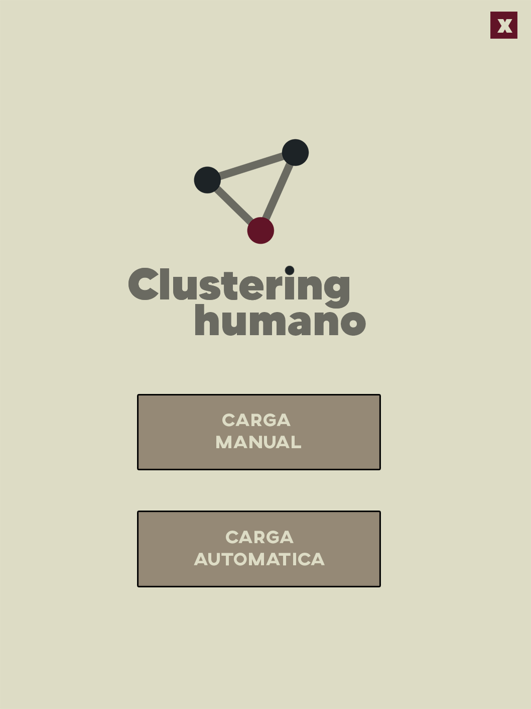
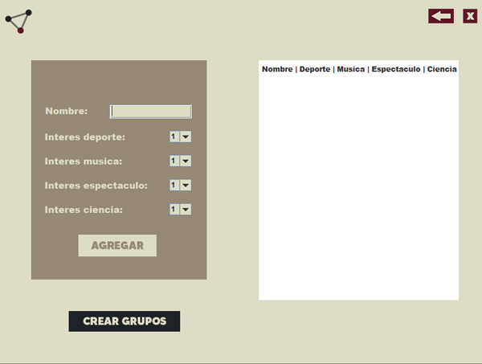

# Clustering humano

Pequeña aplicación realizada como parte del proyecto de la materia Programación III del tercer año de la carrera Licenciatura en Sistemas de la Universidad Nacional General Sarmiento.

El clustering es una técnica de aprendizaje automático que se utiliza para organizar un conjunto de datos en grupos, donde los elementos dentro de cada grupo son más similares entre sí que con los elementos de otros grupos.

## Tabla de contenidos

- [Introducción](#introducción)
- [Clases](#clases)
- [Logros](#logros)
- [Instalación](#instalación)

## Introducción

El objetivo del proyecto es implementar una aplicación para identificar automáticamente a grupos de personas sobre la base de sus intereses. Tenemos una lista de personas, y para cada persona <i>i</i> tenemos su nombre y los siguientes datos:

- d<sub><i>i</i></sub>   = Interés por los deportes.
- m<sub><i>i</i></sub> = Interés por la música.
- e<sub><i>i</i></sub>   = Interés por las noticias del espectáculo.
- c<sub><i>i</i></sub>   = Interés por la ciencia.

Cada uno de estos datos se expresa en números enteros entre 1 y 5, siendo 1 el menor interés y el 5 el máximo interés en el tema.



## Clases

### Paquete algoritmos

En este paquete se encuentran los algoritmos relacionados con la reorganización y recorrido de los grafos.

### AGM
(Árbol generador mínimo). Se encarga de crear un nuevo grafo con la mínima cantidad de aristas con menor peso posible.

- arbolGeneradorMinimo(Grafo grafo): Recibe un grafo como parámetro y lo convierte en un árbol generador mínimo retornado en un nuevo grafo.

### BFS 

(Breadth-first search). Esta clase tiene dos funciones que obtienen un resultado a partir del recorrido del grafo.

- esConexo(Grafo grafo): Verfica que el grafo sea conexo. Un grafo es conexo si existe al menos un camino de un vértica a otro.
- alcanzables(Grafo grafo, int origen): Devuelve una lista con el camino de los vértices que se pueden alcanzar a partir del origen ingresado.

### Paquete clustering

El paquete clustering contiene las clases que se encargan de manipular y calcular los datos que se ingresan. Así como la creación del grafo y la creación de los datos de las personas.

### Grafo

Es la estructura del objeto Grafo y ofrece todas las funciones que este puede hacer.

### Cluster

Sus únicas funciones son crear y dividir el grafo. Es una clase que se extiende de la clase Grafo y el único motivo de esta separación fue para no saturar la clase de métodos y código.

- crearGrafo(ArrayList lista_personas): Crea y retorna un grafo a partir de una lista de personas.
- dividirGrafo(Grafo grafo): Retorna dos listas de enteros que corresponden a los dos grupos de vértices que se forman al dividr el grafo.

### Persona

Es la clase donde modela las características de cada persona que va a integrar el grafo.

### Principal

Se encarga de conectar la parte visual con el código de negocio. Brinda todas las funciones que la interfaz visual pueda necesitar.

- crearGrupos(): retorna dos listas con los nombres que pertenecen a cada grupo de personas previamente agregadas. El método arroja una excepción si no se cargó ninguna persona o la lista es menor a dos personas.

### Paquete interfaz_visual

Contiene tres ventanas que conducen a las dos maneras de cargar la información, de forma manual o automática.

<table style="width:100%">
<tr>
<td>
<a>

</a>
</td>
<td>
<a >

</a>
</td>
<td>
<a >

</a>
</td>
</tr>
</table>

### Inicio

Te muestra las dos opciones para cargar las personas.

### Carga_manual

Interfaz para cargar de forma personalizada los datos de las personas.

### Carga_automatica

Contiene 4 listas de personas con diferentes tópicos a modo ejemplo que se pueden seleccionar para ver sus datos y luego poder mostrar los dos grupos resultantes.

## Logros

## Instalación

```shell
-- en el directorio donde quieras el proyecto
git clone https://github.com/elez95/Clustering-humano.git
```
